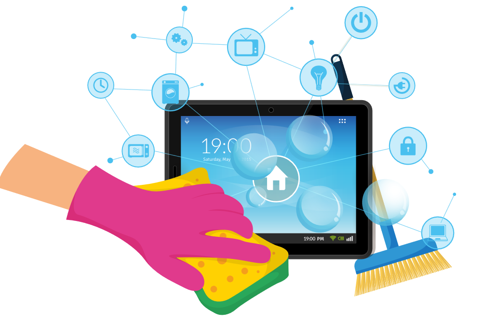

Maker Media GmbH

***

# Frühjahrsputz im Smart Home

**Natürlich macht es Spaß, immer neue Komponenten, Skripte und Module dem eigenen Smart-Home-System hinzuzufügen. Aber einmal im Jahr sollte sich der Administrator hinsetzen und gezielt das System auszumisten und was weiterläuft, auf den aktuellsten Stand bringen. So klappt's systematisch und tut auch nicht weh.**

Hier gibt es die Checkliste für die eigene Smart-Home-Wartung zum [Download als PDF](./ChecklisteSmartHomeWartung.pdf).

Der vollständige Artikel steht in der **[Make-Ausgabe 2/24](https://www.heise.de/select/make/2024/2/2404608100969077283)**.